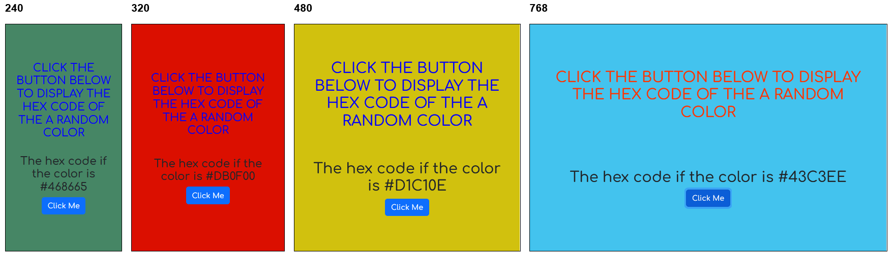

# Hex Colors

A page that generates a hex-code of a random color. Outputs this code and changes the page color to it.
Has a responsive design.

  


# [GitHub page](https://teredet.github.io/Hex-Colors/)

# Download & Setup Instructions :
* Clone the project. This will download the GitHub respository files onto your local machine.</br>
```Shell
git clone https://github.com/teredet/Kyvi-calculator
```
* Run program
```Shell
    index.html
```

# Features
* Display hex-code.
* Change background to this color.
* Text animation.
# Tech Stack
* HTML/CSS
* JavaScript
